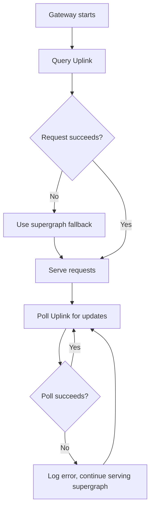
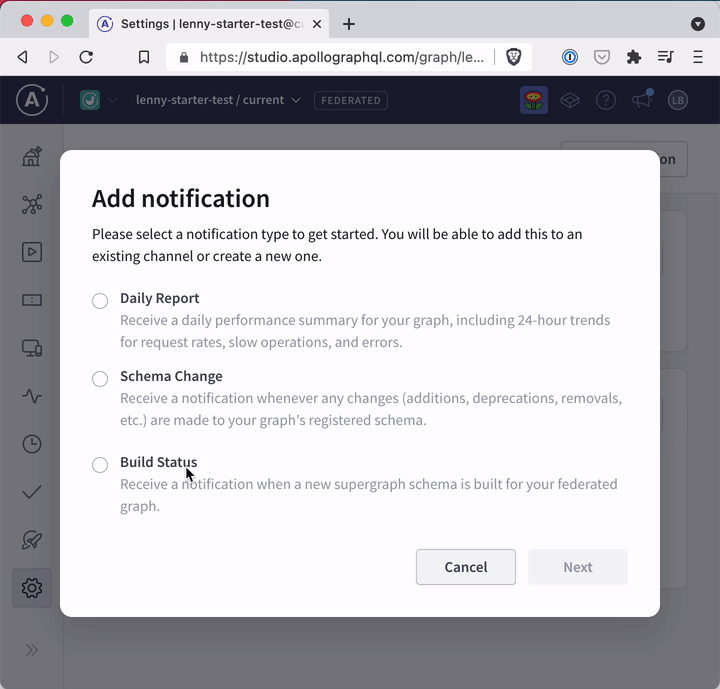

# Managed Federation Resiliency

**The code in this repository is experimental and has been provided for reference purposes only. Community feedback is welcome but this project may not be supported in the same way that repositories in the official [Apollo GraphQL GitHub organization](https://github.com/apollographql) are. If you need help you can file an issue on this repository, [contact Apollo](https://www.apollographql.com/contact-sales) to talk to an expert, or create a ticket directly in Apollo Studio.**

## Introduction

[Managed federation](https://www.apollographql.com/docs/federation/managed-federation/overview/) is designed to be highly reliable:

- Apollo Gateway will continue to function during intermittent Uplink outages, serving traffic using the last known supergraph schema.
- Uplink is deployed multi-cloud and multi-region, and Apollo Gateway will round-robin requests between deployments.

However, if an instance of Apollo Gateway tries to start up while Uplink is unavailable, it will fail to load. If an Uplink outage coincides with a deploy or when scaling up the number of gateway instances, those instances will fail to start.

The solution is to provide a fallback supergraph schema if the request to Uplink fails on startup. After loading, Apollo Gateway then polls Uplink until it is available.



## Demo details

This AWS-flavored demo uses [CDK](https://docs.aws.amazon.com/cdk/index.html) to provision:

- An S3 bucket for storing supergraph schema backups.
- A Lambda function for receiving the Build Notification webhook from Studio.
- A Lambda function for serving the gateway using [apollo-server-lambda](https://www.npmjs.com/package/apollo-server-lambda). **This is just for demonstration purposes. Your gateway can live anywhere, as long as it can fetch the fallback supergraph from somewhere.**
- API Gateways for routing to HTTP requests to the Lambda functions.
- Support for securing webhooks using a secret.

### Try it out

Prerequisites to run this demo:

- Node 14 or greater and Yarn
- The [AWS CLI](https://docs.aws.amazon.com/cli/latest/userguide/getting-started-install.html) and an AWS account
- A federated graph in Apollo Studio **using `@apollo/gateway` version 2.1.0 or later**

Steps:

1. Obtain AWS credentials and export them as environment variables for
   subsequent commands.

   ```sh
   export AWS_ACCESS_KEY_ID=ABCD1234EFGH7890
   export AWS_SECRET_ACCESS_KEY=AbcD/eFGHijKLmnoPQRsTuvWXyZ
   ```

2. Obtain an Apollo API key with at least the Contributor role for your Gateway.
   Export the key and a graph ref for subsequent commands.

   ```sh
   export APOLLO_KEY=service:mygraph:Abcd1234EfgH5678
   export APOLLO_GRAPH_REF=mygraph@current
   ```

3. Generate a secret for the webhook.

   ```sh
   export WEBHOOK_KEY=$(openssl rand -hex 20)
   ```

4. Put Apollo key and webhook key in AWS Secrets Manager.

   ```sh
   aws secretsmanager create-secret --name apollo-key --secret-string $APOLLO_KEY
   aws secretsmanager create-secret --name webhook-key --secret-string $WEBHOOK_KEY
   ```

   After each create command, you'll see output like this:

   ```json
   {
     "ARN": "arn:aws:secretsmanager:us-east-1:123456789000:secret:webhook-key-123456",
     "Name": "webhook-key",
     "VersionId": "12345678-888d-40ac-a348-89499a47cb64"
   }
   ```

   Copy the ARN for the secret and paste it into `infra/cdk.context.json`. The file should like this:

   ```json
   {
     "apolloKeyArn": "arn:aws:secretsmanager:us-east-1:123456789000:secret:apollo-key-123456",
     "webhookKeyArn": "arn:aws:secretsmanager:us-east-1:123456789000:secret:webhook-key-123456"
   }
   ```

5. Install dependencies

   ```sh
   yarn install
   ```

6. Bootstrap your CDK stack

   ```sh
   yarn workspace infra cdk bootstrap
   ```

7. Build the Lambda functions

   ```sh
   yarn workspace gateway build
   yarn workspace webhook-handler build
   ```

8. Deploy your stack

   ```sh
   yarn workspace infra cdk deploy
   ```

   After the deploy is complete, the output will contain URLs for both the
   gateway and webhook handlers:

   ```
   ✅  InfraStack

   Outputs:
   InfraStack.gatewayurl = https://abcd1234.execute-api.us-east-1.amazonaws.com
   InfraStack.webhookurl = https://zyxw0987.execute-api.us-east-1.amazonaws.com
   ```

9. Create a notification channel [by running this operation in Studio][channelop].
   Before executing the operation, ensure to include:

   - An `x-api-key` header for your graph admin API key (this key must be have
     the Graph Admin role or higher)
   - The `$WEBHOOK_KEY` secret as the `secretToken` variable
   - The webhook API endpoint as the `url` variable

   ```json
   {
     "serviceId": "mygraph",
     "name": "aws-fallback-webhook",
     "secretToken": "abcd1234efgh5678",
     "url": "https://zyxw0987.execute-api.us-east-1.amazonaws.com"
   }
   ```

10. Visit Studio to create a Build Status notification using the channel created
    in the previous step.

    

11. Trigger a launch by publishing a subgraph change to your graph with Rover

    ```sh
    rover subgraph publish mygraph@current --name products --schema products.graphql
    ```

12. Visit Sandbox for your gateway Lambda function

    ```sh
    open "https://studio.apollographql.com/sandbox/explorer?endpoint=https://abcd1234.execute-api.us-east-1.amazonaws.com/"
    ```

    The gateway example is purposefully broken and will never successfully fetch
    the supergraph schema from Studio's Uplink API. So if you see a schema in
    Sandbox, then the fallback function is working.

[channelop]: https://studio.apollographql.com/sandbox/explorer?endpoint=https%3A%2F%2Fgraphql.api.apollographql.com%2Fapi%2Fgraphql&explorerURLState=N4IgJg9gxgrgtgUwHYBcQC4RxighigSwiQAIBJJAZwQCcUBhAC1ySQQBsB1AlRgZQRQaCFAAoAOqRIASajQBuBKAjJh05ACIBCSSRlJcidXxQ0CSAOZaANLpnUhIgCoQA1smOnzV21Okwadk8zSx0kAEoSYDs5RWVRAjV7WjiVMEjoqT0YAAc5BmZWDlEAdwQAI0YINyYWNiCogyN9QwRrEgdhFBd3JHVZQS6e5HaAhv9AgF8Muz09RNm5poRFybs1pEmQaxB5XDNccvYESgwQTL1xEFilNKv1K4BGK99LkGX7kivcEsoAWgAZrh2OxyrgoK4-mVKtVXC87FdOs43MhPld4VIrmM0SB0ZsQJMgA
